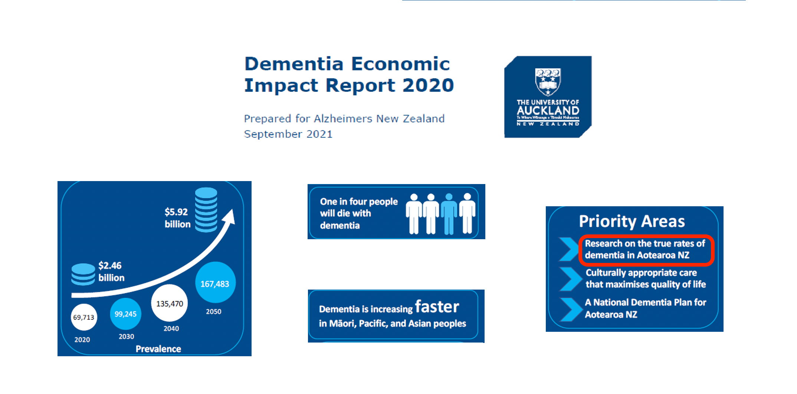
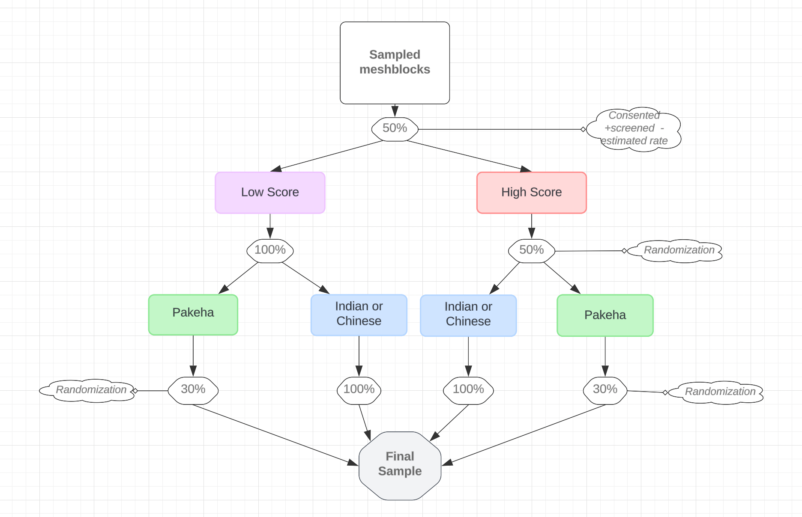

--- 
output:
  revealjs::revealjs_presentation:
    theme: white
    slideNumber: true 
    fig_path: "/Users/criv292/Uni of Auckland Dropbox/CRR-DropBox/Talks & Short courses/NZSA2024/"
    css:   "custom_styles.css" 
    width: 1300                # Set the width of the presentation
    height: 768                # Set the height of the presentation
--- 

#  Sampling small older populations:
 

  _Methods and challenges of a dementia prevalence study_


**NZSA2024**

{fig-align="center" width="700"}

*Claudia Rivera-Rodriguez, PhD*

#  New Zealand changing population 

   

# The need for a prevalence study

  


# Feasibility study (2020)

  

- Demonstrated that a prevalence study was feasible in **Māori**, **Chinese**, **Indian** and **Pākehā** 
 
- We found that the sampling/doorknocking strategy  was reasonable 

- We were able to train up  multi-ethnic  interviewers 

- Response rate  at the door-knocking stage was 75%  but at subsequent stages was about 25% 


# IDEA Study 

- **Aim**:  *Establish the true current prevalence of dementia in NZ*

- Population:  Chinese, Indian and Pākehā  65yo+

- This talk presents the sampling design and lessons learned from the IDEA study


- *There is separate  study for Māori(running at the moment too)*
 


 

```{r setup, include=FALSE, message=FALSE, warning=FALSE }
dire <- '/Volumes/research/resmed202400103-idea-data/' 
library(tidyverse)
library(sf)
## reading files 
df.mesh   <- read.csv(paste(dire, "Sample selection/Sample and Frame/Frame_Meshblocks_with_probabilities25-02-2024.csv", sep=''))
df.area   <- read.csv(paste(dire,"Sample selection/Sample and Frame/Frame_Areas_with_probabilities25-02-2024.csv", sep=''))
df.rep    <- read.csv(paste(dire,"Sample selection/Sample and Frame/ReplacementMeshblocksforSample_with_probabilities25-02-2024.csv", sep=''))
df.mesh.s <- read.csv(paste(dire,"Sample selection/Sample and Frame/SampleMeshblocks_with_probabilities25-02-2024.csv", sep=''))
df.area.s <- read.csv(paste(dire,"Sample selection/Sample and Frame/SampleAreas_with_probabilities25-02-2024.csv", sep=''))
df.TA <-  st_read(paste(dire,'Sample selection/Data/sf_TA/territorial-authority-2022-generalised.shp'  , sep=''))
df_redcap <-  read.csv(paste(dire,  "Data/Raw_data/REDcap_processed/df_all_processed_06-11-2024_weights_imputed.csv", sep=''))

df_simu <-  read.csv(paste(dire, "Sample size Simulations/Results/SampleSizeSimulation25-02-24_A_screeeningALL_long.csv", sep=''))
df_simu <- df_simu|> mutate(Tot_areas=Total_ua +Total_ra, tot_are= cut(Tot_areas, c(40, 50, 60,70, 80,   Inf))) |> group_by(tot_are, propP) |> mutate( area_eqn_mean= round(  mean(n)), area_eqn_min=  round(min(n)),area_eqn_max=  round(max(n))  ) 

library(RColorBrewer)
library(viridis)


circle_center <- c(x = 420, y = 0.03)
radius <- 0.005
angle_seq <- seq(0, 2 * pi, length.out = 100)  # Angle sequence for the circle

# Calculate circle coordinates using parametric equations
circle_data <- data.frame(
  x = circle_center[1] + radius * cos(angle_seq),  # x = center_x + r * cos(angle)
  y = circle_center[2] + radius * sin(angle_seq)   # y = center_y + r * sin(angle)
)


ethnicity_colors <- c("Chinese" = "#E65100",  # Tomato Red
                      "Indian" = "#33CCCC",  # Dodger Blue
                      "Pakeha" = "#9B59B6" )  # Gold


df_sub <- df_simu[df_simu$propP == 0.3, ]
vline_positions <- df_sub$area_eqn_mean 
# Define the labels for each vertical line
vline_labels <-  df_sub$tot_are

lab_df <- data.frame(vline_labels=as.character(vline_labels),vline_positions=vline_positions )
lab_df <- lab_df[!duplicated(paste(lab_df[,1], lab_df[,2])),]
lab_df$vline_positions2 <- c(550, 640, 478, 420, 383)
lab_df <- rbind(lab_df,c('Total areas -> ',  340, 340))
lab_df$vline_positions <- as.numeric(lab_df$vline_positions)
lab_df$vline_positions2 <- as.numeric(lab_df$vline_positions2)

vline_positions <- lab_df[,2]
# Define the labels for each vertical line
vline_labels <-  lab_df[,1]
lab_df$y =0.014

 df_sub <- df_sub |> mutate(col= case_when(Ethnicity=='Chinese'~400, Ethnicity=='Indian'~380, Ethnicity=='Pakeha'~430, TRUE~NA))

p_simu<- ggplot(data =df_sub , aes(x = n, y = Margin.e, color = Tot_areas)) +
  geom_point(size = 2.5) +  # Increase point size to 2.5
  geom_hline(yintercept = 0.032, linetype = "dashed", color = "orange", size=1.2) +  # Add horizontal dashed line at y = 0.032
  coord_cartesian(ylim = c(0.015, 0.045)) + xlim(c(300,800))+ # Adjust the visible y-axis range without removing data
  labs(title = "Margin of error vs total sample size by Ethnicity (domain)",
       x = "Total sample size", y = "Margin of error", color = "Number of areas") +  
    geom_vline(data= df_sub, aes(xintercept = col) , linetype = "dashed", color = "purple" ) +
  #scale_color_manual(values = ethnicity_colors) +  # Apply the expanded custom high-contrast color palette
  theme_minimal() +  # Simplified theme with larger font size
  theme(
    legend.position = "top",  # Place the legend at the top for better readability
    legend.title = element_text(size = 12),
    legend.text = element_text(size = 10),
    axis.title = element_text(size = 14),  # Larger axis labels
    axis.text = element_text(size = 12)    # Larger tick labels
  ) +
    facet_wrap(~ Ethnicity, scales = "free_y")  # Facet by Ethnicity with independent y-axis scales
 
         
df.area <- df.area |> mutate(SA22018_V1_00=as.character(SA22018_V1_00))


df.TA_sf <- st_as_sf(df.TA,  wkt = "WKT" )
st_crs(df.TA_sf)$epsg
df.TA_sf <-st_transform(df.TA_sf, 4326) 
## are geometr
df.area.sf<- st_read(paste(dire,'Sample selection/Data/sf_area2/statistical-area-2-2018-generalised.shp' , sep='') ) 
df.area.sf <- df.area.sf|> dplyr::mutate(SA22018_V1_00= SA22018_V1)  |>
  filter( SA22018_V1_00 %in%  df.area$SA22018_V1_00)
df.area.sf<-  left_join( df.area.sf,df.area , by='SA22018_V1_00') %>%filter(SA22018_V1_00%in%df.area$SA22018_V1_00)%>%dplyr::mutate(SA22018_V1_00=as.character(SA22018_V1_00)) 
df.area.sf<- st_transform(df.area.sf, crs=4326)
df.area.sf$ID  <-df.area.sf$SA22018_V1 

df.area.sf <- df.area.sf %>%   dplyr::mutate(SA22018_V1_00= SA22018_V1)  |>
  filter( SA22018_V1_00 %in%  df.area$SA22018_V1_00)


df.mesh.sf<-  st_read(paste(dire,'Sample selection/Data/sf_mesh/meshblock-2018-generalised.shp'   , sep='') ) 
df.mesh.sf <- df.mesh.sf|> dplyr::mutate( MB2018_V1_00 = stringr::str_replace(MB2018_V1_, '\\d+', function(m) sprintf('%07s', m)), MB2018_V1_00=paste('m',MB2018_V1_00, sep=''))  |>
  filter( MB2018_V1_00 %in%  df.mesh$MB2018_V1_00)
df.mesh.sf<-  left_join(df.mesh.sf,df.mesh, by='MB2018_V1_00')%>%filter(MB2018_V1_00%in%df.mesh$MB2018_V1_00) 
df.mesh.sf     <-  st_transform(df.mesh.sf, crs=4326)
df.mesh.sf$ID  <-  df.mesh.sf$mesh_area

 
library(dplyr)
df_redcap <- df_redcap %>% dplyr::mutate( date_sampling= as.Date(date_screening), study_week= as.numeric(strftime(date_sampling, format = "%U"))-12, study_month= format(date_sampling, "%m"), Screened= case_when(in_sample==1~ 'Full Interviewed', in_sample==0~ 'Only Screened' ),
                   Diagnosis= case_when(in_sample==1&dem1066_short==1~ 'Dementia', in_sample==1&dem1066_short==0~ 'No Dementia', in_sample==1 &is.na(dem1066_short) ~ 'No informant' , in_sample==0   ~ 'Only Screened', TRUE~ 'Only Screened'), 
                   Diagnosis=  factor(Diagnosis, levels=c('Dementia','No Dementia', 'No informant', 'Only Screened')),
                   Dementia = case_when(Diagnosis=='Dementia'~1, Diagnosis=='No Dementia'~0, TRUE~NA),
                   Gender= case_when(psex==1~'Male', psex==2 ~ 'Female', TRUE~ NA ),Ethnicity0= as.character(ethnic), Ethnicity=  ethnic2 , Age= age_cat,
                   LowScore=as.character(low_score), 
                   existingID= !is.na(id) , 
                   Ethnic_IDEA =  case_when(!is.na(ethnic3)~ethnic3,  is.na(ethnic3)~ 'Other'),
                   Ethnic_P =  ethnic_prior  ) %>%filter(!is.na(study_month)&Ethnic_IDEA!='Other' )


sum_sampling <- df_redcap %>% arrange(study_week, Ethnic_IDEA)%>% dplyr::group_by(study_week, Ethnic_IDEA) %>% dplyr::summarize(Screened= n(), Full_int = sum(in_sample))


sum_sampling_m <- df_redcap %>% arrange(study_week, Ethnic_IDEA)%>%dplyr::group_by(study_month, Ethnic_IDEA) %>% dplyr::summarize(Screened= n(), Full_int = sum(in_sample))
sum_sampling_m <- sum_sampling_m %>% dplyr::group_by(Ethnic_IDEA)%>% dplyr::mutate(Full_int_cum= cumsum(Full_int),Screened_cum= cumsum(Screened), Consent_rate= Full_int_cum/Screened_cum )


library(ggplot2)
 

p1<-ggplot(sum_sampling, aes(x=study_week, y=Screened, group=Ethnic_IDEA)) +
  geom_line(aes(color=Ethnic_IDEA))+
  geom_point(aes(color=Ethnic_IDEA))
 

p2<-ggplot(sum_sampling, aes(x=study_week, y=Full_int, group=Ethnic_IDEA)) +
  geom_line(aes(color=Ethnic_IDEA))+
  geom_point(aes(color=Ethnic_IDEA))
 

  
## indian 425, pakeha 485, chinese: 410
##  45	12 


p3 <- ggplot(sum_sampling_m, aes(x = study_month, group = Ethnic_IDEA)) +
  # Dotted line and points for Screened
  geom_line(aes(y = Screened, color = Ethnic_IDEA, linetype = "Short screening")) +
  geom_point(aes(y = Screened, color = Ethnic_IDEA )) + 
  # Solid line and points for Full_int
  geom_line(aes(y = Full_int, color = Ethnic_IDEA, linetype = "Full interview")) +
  geom_point(aes(y = Full_int, color = Ethnic_IDEA )) + 
  labs(title = "Screened and sampled participants over time", 
       x = "Month of study",
       y = "Count")+
  guides(linetype = guide_legend(title = "Type questionnaire"))
 
 
 


p4 <- ggplot(sum_sampling_m, aes(x = study_month, group = Ethnic_IDEA)) +
  # Dotted line and points for Screened
  geom_line(aes(y = Screened_cum, color = Ethnic_IDEA, linetype = "Short screening")) +
  geom_point(aes(y = Screened_cum, color = Ethnic_IDEA )) + 
  # Solid line and points for Full_int
  geom_line(aes(y = Full_int_cum, color = Ethnic_IDEA, linetype = "Full interview")) +
  geom_point(aes(y = Full_int_cum, color = Ethnic_IDEA ))+ 
  labs(title = "Screened and sampled participants over time", 
       x = "Month of study",
       y = "Cumulative Count")+
  guides(linetype = guide_legend(title = "Type questionnaire"))
 
 


  

library(plotly)
```
```{r, echo=FALSE, include=FALSE,  message=FALSE, warning=FALSE }
# Load the DiagrammeR package
library(DiagrammeR)

# Create the flow diagram with rounded corners for the boxes
# Load the DiagrammeR package
library(DiagrammeR)

# Create the flow diagram with rounded corners, custom fill colors, and horizontal layout
graph <- "
digraph flow {

  # Set graph layout to horizontal (left to right)
  rankdir = LR;

  # Define node properties with rounded corners and filled color
  node [shape = rect, style = filled, fontname = Helvetica, fontsize = 12, width = 2, height = 0.6, color = black, fontcolor = black, fillcolor = lightyellow];

  # Define the nodes (phases) with custom fill colors
  Areas [label = 'Phase 1: Areas', fontcolor = red, width = 2.5, style = rounded]
  Meshblocks [label = 'Phase 2: Meshblocks', fontcolor = blue, width = 2.5, style = rounded]
  Screening [label = 'Phase 3: Participants', fontcolor = black, width = 2.5, style = rounded]

  # Define the edges (arrows) with labels and colors
  Areas -> Meshblocks [label = '', fontsize = 10, color = black ];
  Meshblocks -> Screening [label = '', fontsize = 10, color = black, fontcolor = black];

  # Styling the edges (arrows)
  edge [arrowhead = vee, arrowsize = 1.5, color = gray];
}
"


# grViz(graph)

 

# Render the diagram with horizontal layout
 

```

# Sampling strategy

```{r, fig.align="center", fig.width=5, fig.height=3,echo=FALSE, message=FALSE, warning=FALSE }


```
 

## Frame: Territorial autorities

 
 

  
   
## Sampling phases


 
<span style="color:red">**Phase 1**</span>  
 
- Stratified by TA and rurality 

- Oversampling of   Chinese/Indian(65+) dense areas 
  
--- 
 

<span style="color:blue">**Phase 2**</span>    

- A proportion of meshblocks is sampled from each area selected at phase 1

- Sampling of meshblocks is proportional to the density of Chinese and Indians. 

 
 
--- 

 Phase 3

  
 
## Sample sizes for each domain 

- We run lots of simulations to identify   sensible   sample parameters:
   


## Sample sizes for each domain 

 
```{r , echo=FALSE, message=FALSE, warning=FALSE }
p_simu

```

We decided on a margin of error of about 0.03,


# Our design:  inclusion probabilities-areas
 
 
```{r , echo=FALSE, message=FALSE, warning=FALSE }
 library(ggmap)
 
#the package below was installed from source through github: 
# devtools::install_github("ropensci/rnaturalearthhires"))

 

theme_set(theme_bw())

newzealand <- rnaturalearth::ne_countries(country="New Zealand", type="countries", scale = 'large',  
                           returnclass = "sf")

p0  <-  ggplot()+  geom_sf(data = newzealand,color='grey') +
  xlim(166, 179) +
  ylim(-48, -34)

 
# For google map, you have to give the center of the window you are looking at.
# Possibility for the map type argument: terrain / satellite / roadmap / hybrid
 
# get the map info
# map <- get_googlemap("New Zealand", zoom = 8 )
#  
# # # Plot it
#   ggmap(map) + 
#     theme_void() + 
#    ggtitle("terrain") + 
#     theme(
#      plot.title = element_text(colour = "orange"), 
#       panel.border = element_rect(colour = "grey", fill=NA, size=2)
#     )
#   
#   map <- get_map(location = c(173,-40), zoom = 21, maptype='roadmap')
# ggplotly( ggmap::ggmap(map)  )

dfTA_AKL <-  df.TA_sf[df.TA_sf$TA2022_V_2=='Auckland',]
dfTA_CHC <-  df.TA_sf[df.TA_sf$TA2022_V_2%in% c('Christchurch City', 'Selwyn District', 'Waimakariri District'),] 
dfTA_AKLCHC <-  df.TA_sf[df.TA_sf$TA2022_V_2%in% c('Auckland','Christchurch City', 'Selwyn District', 'Waimakariri District'),]


plot_data1 <- ggplot_build(ggplot()+geom_sf(data=dfTA_AKL    ) )
plot_data2 <- ggplot_build(ggplot()+geom_sf(data=dfTA_CHC   ) )
plot_data12 <- ggplot_build(ggplot()+geom_sf(data=dfTA_AKLCHC   ) )


xlima <- plot_data1$layout$panel_scales_x[[1]]$range$range
ylima <- plot_data1$layout$panel_scales_y[[1]]$range$range
 
xlimc <- plot_data2$layout$panel_scales_x[[1]]$range$range
ylimc <- plot_data2$layout$panel_scales_y[[1]]$range$range
 
xlimac <- plot_data12$layout$panel_scales_x[[1]]$range$range
ylimac <- plot_data12$layout$panel_scales_y[[1]]$range$range
 

p   <-      ggplot()+geom_sf(data=df.TA_sf    )  
xlimTA <- ggplot_build(p)$layout$panel_scales_x[[1]]$range$range
  

p2a <-     geom_sf( data = df.area.sf, aes(   fill=pik ,color = pik ))  
 


p2_AKLCHC <- p+p2a  +ggtitle('Selection probabilities of areas AKL and CHC') +ylim(ylimac) +xlim(xlimac) 
p2_AKL <- p+p2a  +ggtitle('Selection probabilities of areas Auckland') +ylim(ylima) +xlim(xlima) 
p2_CHC <- p+p2a +    ggtitle('Selection probabilities of areas Canterbury') + ylim(ylimc) +xlim(xlimc) 
 
ggpubr::ggarrange(p2_AKL, p2_CHC, ncol=2)
 
``` 
 
```{r cars278, echo=FALSE,  warning=FALSE, message=FALSE, include= TRUE, message=FALSE, warning=FALSE } 


pa<- ggplot(df.area, aes(x = as.numeric(pik))) +
  geom_histogram(binwidth = 0.05, fill = "skyblue", color = "black") +
  ggtitle("Histogram of inclusion Area probabilities") +
  theme_minimal()

pb<- ggplot(df.area, aes(x = as.numeric(pik), y = as.numeric(Indian65_2per), color = UrbanRural)) +
  geom_point() +
  scale_color_manual(values = c("Rural" = "red", "Urban" = "blue")) +
  ggtitle("Inclusion Area Probability vs Indian65Prop") +
  theme_minimal()

pc<- ggplot(df.area, aes(x = as.numeric(pik), y = as.numeric(Chinese65_2per), color = UrbanRural)) +
  geom_point() +
  scale_color_manual(values = c("Rural" = "red", "Urban" = "blue")) +
  ggtitle("Inclusion Area Probability vs Chinese65Prop") +
  theme_minimal()+ 
  labs( 
       x = "Area inclusion probability",
       y = "Cumulative Count")
   
#ggpubr::ggarrange(pb, pc, ncol=2)
 
```
 
 
 
# Challenges   (So Far)
 

-  Meshblocks with only businesses, not residential dwellings: We  replace these with the closest meshblock (based on selection probability) from the same area.

- Door-knocking is expensive and difficult. 

- Training of interviewers in 4 different languages 

- Consent rates vary across ethnicities: Sampling weights will need adjustment  for this.

- Data processing from questionnaires in four different languages.

 
#  How is the recruitment going?

```{r ,echo=FALSE, message=FALSE, warning=FALSE }
p4
```

# Thank you!


